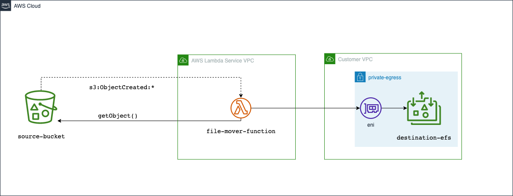
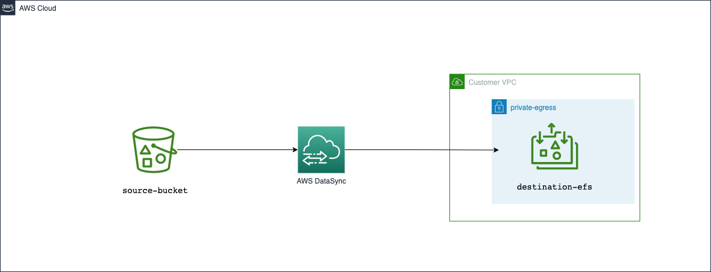

# aws-s3-to-efs

This Typescript CDK project containers two example stacks demonstrating how you can transfer files from S3 to EFS

## aws-s3-to-efs-via-lambda

This stack use S3 events to trigger a lambda function with an EFS filesystem mount to read the files from S3 and write them to EFS.



## aws-s3-to-efs-via-datasync

This stack uses [AWS DataSync](https://docs.aws.amazon.com/datasync/latest/userguide/what-is-datasync.html) to transfer files between S3 and EFS




## Prerequisites

1. Install [NodeJS](https://nodejs.org/en/download/)
1. Install latest [AWS CDK Toolkit](https://docs.aws.amazon.com/cdk/v2/guide/cli.html)
   1. [Bootstrap](https://docs.aws.amazon.com/cdk/v2/guide/getting_started.html#getting_started_bootstrap) you AWS Account (only needs to be done once per account/region/role )

## Deploy

* Install python dependencies

  ```npm install```

* Build the project

  ```npm run build```

  * Deploy to AWS

    (You'll need AWS credentials on the terminal for this to run correctly)

    * **aws-s3-to-efs-via-lambda**

      ```npm run deploy --  aws-s3-to-efs-via-lambda```
    
    * **aws-s3-to-efs-via-datasync**

      ```npm run deploy -- aws-s3-to-efs-via-datasync```

   
### Viewing files in EFS

See [Simple File Manager for Amazon EFS
](https://aws.amazon.com/solutions/implementations/simple-file-manager-for-amazon-efs/)